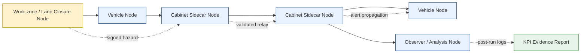

# PingNet

## Connected Safety for Work Zones

PingNet is a local-first, infrastructure-light connected safety system designed to improve hazard awareness in roadway work zones and constrained corridor environments.

The current focus is a pilot-ready work-zone safety layer that relays authenticated hazard messages between cabinet nodes, vehicle nodes, work-zone nodes, and observer nodes without relying on continuous cellular coverage or continuous backhaul connectivity.

PingNet is **not** currently being positioned as a broad V2X replacement, a citywide traffic platform, or a consumer mobile launch. The near-term goal is to generate defensible safety evidence through controlled pilot deployments.

---

## Current Status

PingNet has completed a validated six-node pilot baseline using Raspberry Pi hardware and mixed node roles.

The system has demonstrated:

- 3 consecutive validated work-zone dry runs
- 6/6 nodes observed in every run
- 100% delivery reliability
- 0 missing downstream receipts
- 100% signature validation success
- 0 invalid signatures accepted
- p95 latency range of 36–299 ms
- replay and duplicate suppression
- full log collection and KPI generation
- sponsor-ready evidence output

Current status: **pilot-ready baseline achieved**.

The next technical step is expansion to **10–12 nodes**, followed by reliability characterization toward a **20–30 node corridor pilot**.

---

## Pilot Use Case

The current pilot use case is **work-zone hazard propagation**.

A work-zone node, vehicle node, or cabinet sidecar node generates a signed hazard message. Nearby nodes validate the message, reject replays or duplicates, and relay the message across the local corridor mesh. Observer nodes collect evidence for post-run KPI analysis.

The pilot measures:

- delivery reliability
- latency
- delivery rate
- replay rejection
- signature validation
- node uptime
- time-to-awareness improvement

The goal is to answer one practical question:

> Can a local-first hazard propagation system improve awareness of work-zone hazards in a measurable, repeatable way?

---

## Pilot Architecture



Simple view:

```text
[Work-zone node]
        |
        v
[Vehicle node] <-> [Cabinet sidecar] <-> [Cabinet sidecar] <-> [Vehicle node]
                                      |
                                      v
                          [Observer / analysis node]
                                      |
                                      v
                           [KPI evidence report]
```

---

## Node Roles

### Cabinet Sidecar Node

A cabinet sidecar node is a small edge device placed inside or near an existing traffic signal controller cabinet.

It is intended to be:

- cleanly installed
- reversible
- non-intrusive
- independent of traffic signal control
- used for local hazard relay and evidence collection

A cabinet sidecar node does **not** modify controller software, timing plans, or safety-critical cabinet functions.

### Vehicle Node

A vehicle node is a portable unit placed in a participating agency vehicle.

Vehicle nodes can:

- receive work-zone or roadway hazard alerts
- relay validated messages when policy allows
- log events for KPI analysis

Phase 1 vehicle candidates include:

- public works vehicles
- traffic operations vehicles
- police vehicles
- utility or inspection vehicles
- other municipal fleet vehicles on a selected corridor

Vehicle nodes do **not** require CAN bus integration for the first pilot phase.

### Work-Zone Node

A work-zone node represents the active or simulated hazard source.

It may be placed near:

- lane closures
- temporary traffic control areas
- work-zone vehicles
- staged hazard scenarios

Its role is to generate signed hazard messages that can propagate through the local corridor mesh.

### Observer / Analysis Node

Observer nodes collect validation data and support post-run analysis.

They help produce the final KPI evidence package by recording:

- message receipt
- latency
- delivery path behavior
- replay and duplicate handling
- node uptime
- scenario-level observations

---

## How the System Works

PingNet uses a constrained, local-first message path:

```text
Hazard Source
    ↓
Node Runtime
    ↓
Message Validation
    ↓
Policy / Relay Decision
    ↓
Local Transport
    ↓
Nearby Nodes
    ↓
Observer Logs + KPI Report
```

Core behaviors:

- signed hazard messages
- strict replay protection
- duplicate suppression
- bounded relay behavior
- local-first communication
- backhaul used only for logging and analysis
- evidence generation after each run

The safety path is designed to continue operating locally even if backhaul is unavailable.

---

## Validated Baseline

PingNet has completed a validated six-node pilot baseline.

### Test Setup

The baseline used six Raspberry Pi nodes representing a mixed-role environment:

- cabinet node
- vehicle nodes
- work-zone node
- observer node
- responder / supporting roles

### Validated Runs

Three consecutive tagged pilot dry runs were completed:

- `run-20260426-002`
- `run-20260426-003`
- `run-20260426-004`

### Results

| Metric | Result |
|---|---:|
| Nodes observed | 6/6 |
| Delivery reliability | 100.00% |
| Missing downstream receipts | 0 |
| Signature validation success | 100.00% |
| Invalid signatures accepted | 0 |
| p95 latency | 36–299 ms |
| Validation status | PASS |

### What This Proves

The current baseline demonstrates:

- multi-node deployment and orchestration
- deterministic scenario execution with run/scenario tagging
- decentralized message propagation
- cryptographic trust enforcement
- replay and duplicate suppression
- full log collection and KPI generation
- sponsor-ready evidence output

### Known Limitation

Hop-depth evidence is currently log-derived and not yet independently validated through physical topology correlation.

This is acceptable for the current baseline but should be improved during 10–12 node expansion.

---

## KPI Evidence Model

PingNet is now being developed as an evidence-generating pilot system.

The primary KPI is:

> **Reliability**

Supporting KPIs include:

- latency
- delivery rate
- replay rejection
- signature validation
- node uptime
- time-to-awareness improvement

### Evidence Flow

```text
Pilot Scenario
    ↓
Node Logs
    ↓
Collection Manifest
    ↓
KPI Aggregation
    ↓
Sponsor-Facing Report
```

The system already supports structured run IDs, scenario tags, node roles, and post-run KPI summaries.

---

## Current Development Focus

PingNet is currently focused on pilot validation, not broad feature expansion.

Near-term priorities:

1. Expand from 6 nodes to 10–12 nodes
2. Validate repeatable work-zone scenarios
3. Improve independent hop-depth evidence
4. Harden KPI logging and report generation
5. Prepare for 20–30 node corridor pilot discussions
6. Maintain Python runtime through pilot completion

Rust remains a future production-hardening path, but it is not required before pilot evidence is generated.

---

## Technical Direction

The current pilot runtime is Python-based and has been validated for the pilot baseline.

The production direction remains:

- compact runtime
- local-first safety propagation
- strict message validation
- bounded relay behavior
- transport abstraction
- eventual Rust hardening for performance-critical paths

The current engineering principle is:

> Pilot evidence first. Runtime hardening second.

---

## What This Repository Is

This repository is a public technical overview of PingNet’s pilot direction, system boundaries, and validation progress.

It is intended for:

- engineers evaluating the technical problem
- pilot partners reviewing deployment assumptions
- advisors reviewing the architecture
- grant or funding stakeholders seeking technical context

---

## What This Repository Is Not

This repository is not the full production codebase.

It does not include:

- private implementation details
- security-sensitive keys
- deployment credentials
- proprietary pilot materials
- full source code for the active runtime

---

## Pilot Partner Fit

PingNet is currently seeking conversations with:

- city managers
- public works departments
- traffic operations teams
- state and local transportation agencies
- work-zone safety stakeholders
- municipal fleet operators
- contractors involved in roadway work-zone operations

A strong first pilot partner would have:

- one candidate arterial corridor
- several signalized intersections
- a repeatable or simulated work-zone condition
- a small group of participating agency vehicles
- willingness to review a sponsor-ready KPI report

---

## Roadmap

### Completed

- Six-node Raspberry Pi baseline
- Mixed-role node configuration
- Ed25519 message signing
- replay protection
- duplicate suppression
- UDP-based local message propagation
- run/scenario tagging
- log collection
- KPI report generation
- three consecutive validated dry runs

### In Progress

- 10–12 node expansion
- stronger topology and hop-depth validation
- repeatable evidence runs
- pilot partner outreach
- city and DOT pilot discussions

### Next

- 20–30 node corridor pilot
- cabinet sidecar + vehicle node deployment
- active or simulated work-zone scenario
- sponsor-ready after-action report
- grant and pilot funding applications

---

## Longer-Term Direction

PingNet’s broader architecture may later support additional connected safety use cases such as:

- responder awareness
- fleet safety
- infrastructure participation
- C-V2X integration
- cellular bridge support
- constrained drone or UAS participation

These are not the current pilot wedge.

The current execution path remains:

> work-zone hazard propagation → measurable corridor safety evidence → pilot partner validation → scaled deployment.

---

## Contact

Jonathan Garrett Jr.  
Founder, PingNet LLC  

Email: jonathan.garrettjr@pingnet.net  
Website: https://www.pingnet.net  
LinkedIn: https://www.linkedin.com/in/jonathan-garrett-jr  

---

## Status Summary

PingNet has transitioned from prototype to pilot-ready baseline.

The current priority is not expanding features.

The current priority is proving repeatable, measurable safety value in a real-world corridor pilot.
