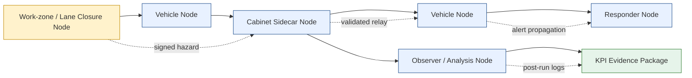

# PingNet

## Connected Safety for Work Zones

PingNet is a local-first, infrastructure-light connected safety system designed to improve hazard awareness in roadway work zones and constrained corridor environments.

The current focus is a work-zone safety layer that relays authenticated hazard messages between cabinet sidecar nodes, vehicle nodes, work-zone nodes, responder nodes, and observer nodes without relying on continuous cellular coverage or continuous backhaul connectivity.

PingNet is not currently being positioned as a broad V2X replacement, a citywide traffic platform, or a consumer mobile launch. The near-term goal is to generate defensible safety evidence through controlled pilot deployments and advisor-guided field validation.

---

## Current Status

PingNet has progressed from a validated six-node pilot baseline to a validated ten-node pre-pilot testbed.

Validated evidence now includes:

- 3 consecutive six-node work-zone dry runs
- 3 consecutive ten-node work-zone dry runs
- 10/10 nodes observed in each ten-node run
- 54/54 downstream receipts delivered across the ten-node evidence set
- 100.00% delivery reliability
- 100.00% signature validation success
- 0 missing downstream receipts
- 0 invalid signatures accepted
- p95 latency range of 30-43 ms in the ten-node runs
- replay and duplicate suppression
- structured run IDs, scenario tags, and node roles
- combined KPI evidence output
- CWZ/WZDx-aligned WorkZoneFeed-style and DeviceFeed-style GeoJSON export artifacts

Current status: **validated pre-pilot scale testbed achieved**.

The next technical step is advisor-guided field-pilot planning, long-duration test discipline, field geometry verification, topology-correlated hop evidence, and runtime hardening toward a 20-30 node corridor pilot.

---

## Pilot Use Case

The current pilot use case is **work-zone hazard propagation**.

A work-zone node, vehicle node, responder node, or cabinet sidecar node generates a signed hazard message. Nearby nodes validate the message, reject replays or duplicates, and relay the message across the local corridor mesh. Observer nodes collect evidence for post-run KPI analysis.

The pilot measures:

- delivery reliability
- latency
- delivery rate
- replay rejection
- signature validation
- node uptime
- time-to-awareness improvement
- export readiness for agency review workflows

The goal is to answer one practical question:

> Can a local-first hazard propagation system improve awareness of work-zone hazards in a measurable, repeatable way?

---

## Pilot Architecture


```mermaid
flowchart LR
    WZ[Work-zone / Lane Closure Node] --> V1[Vehicle Node]
    V1 --> C1[Cabinet Sidecar Node]
    C1 --> V2[Vehicle Node]
    V2 --> EMS[Responder Node]
    C1 --> OBS[Observer / Analysis Node]
    OBS --> REPORT[KPI Evidence Package]

    WZ -. signed hazard .-> C1
    C1 -. validated relay .-> V2
    V2 -. alert propagation .-> EMS
    OBS -. post-run logs .-> REPORT

    classDef node fill:#e8f1ff,stroke:#1f4e8c,stroke-width:1px;
    classDef hazard fill:#fff2cc,stroke:#c28a00,stroke-width:1px;
    classDef report fill:#e6f4ea,stroke:#2e7d32,stroke-width:1px;

    class V1,V2,C1,OBS,EMS node;
    class WZ hazard;
    class REPORT report;
```

Simple view:

```text
[Hazard source]
        |
        v
[Vehicle node] <-> [Cabinet sidecar] <-> [Vehicle node] <-> [Responder node]
                                      |
                                      v
                          [Observer / analysis node]
                                      |
                                      v
                           [KPI evidence package]
```

---

## Node Roles

### Cabinet Sidecar Node

A cabinet sidecar node is a small edge device placed inside or near an existing traffic signal controller cabinet.

It is intended to be:

- cleanly installed
- reversible
- non-intrusive
- independent of traffic signal control
- used for local hazard relay and evidence collection

A cabinet sidecar node does **not** modify controller software, timing plans, or safety-critical cabinet functions.

### Vehicle Node

A vehicle node is a portable unit placed in a participating agency vehicle.

Vehicle nodes can:

- receive work-zone or roadway hazard alerts
- relay validated messages when policy allows
- log events for KPI analysis

Phase 1 vehicle candidates include:

- public works vehicles
- traffic operations vehicles
- police vehicles
- utility or inspection vehicles
- other municipal fleet vehicles on a selected corridor

Vehicle nodes do **not** require CAN bus integration for the first pilot phase.

### Work-Zone Node

A work-zone node represents the active or simulated hazard source.

It may be placed near:

- lane closures
- temporary traffic control areas
- work-zone vehicles
- staged hazard scenarios

Its role is to generate signed hazard messages that can propagate through the local corridor mesh.

### Responder Node

A responder node represents an emergency, public safety, or service vehicle entering the corridor.

Responder nodes can:

- receive validated work-zone hazard alerts
- relay validated messages when policy allows
- produce receipt and latency evidence for post-run analysis

### Observer / Analysis Node

Observer nodes collect validation data and support post-run analysis.

They help produce the final KPI evidence package by recording:

- message receipt
- latency
- delivery path behavior
- replay and duplicate handling
- node uptime
- scenario-level observations

---

## How the System Works

PingNet uses a constrained, local-first message path:

```text
Hazard Source
    -> Node Runtime
    -> Message Validation
    -> Policy / Relay Decision
    -> Local Transport
    -> Nearby Nodes
    -> Observer Logs + KPI Evidence
```

Core behaviors:

- signed hazard messages
- strict replay protection
- duplicate suppression
- bounded relay behavior
- local-first communication
- backhaul used for logging, validation, KPI reporting, and export
- evidence generation after each run

The real-time safety path is designed to continue operating locally even if backhaul is unavailable.

---

## Validated Evidence

PingNet has completed both a validated six-node pilot baseline and a validated ten-node pre-pilot scale testbed.

### Validated Six-Node Baseline

The six-node baseline used Raspberry Pi nodes representing a mixed-role work-zone environment:

- cabinet node
- vehicle nodes
- work-zone node
- observer node
- responder / supporting roles

Three consecutive tagged pilot dry runs were completed:

- `run-20260426-002`
- `run-20260426-003`
- `run-20260426-004`

| Metric | Result |
|---|---:|
| Nodes observed | 6/6 |
| Delivery reliability | 100.00% |
| Missing downstream receipts | 0 |
| Signature validation success | 100.00% |
| Invalid signatures accepted | 0 |
| p95 latency | 36-299 ms |
| Validation status | PASS |

### Validated Ten-Node Pre-Pilot Testbed

The ten-node testbed extends the same evidence discipline to a larger mixed-role environment before field deployment.

Three consecutive tagged ten-node dry runs were completed:

- `run-10node-20260607-190405`
- `run-10node-20260607-192316`
- `run-10node-20260607-193016`

| Metric | Result |
|---|---:|
| Nodes observed | 10/10 |
| Downstream receipts delivered | 54/54 |
| Delivery reliability | 100.00% |
| Missing downstream receipts | 0 |
| Signature validation success | 100.00% |
| Invalid signatures accepted | 0 |
| p95 latency | 30-43 ms |
| Validation status | PASS |

### What This Proves

The current evidence demonstrates:

- multi-node deployment and orchestration
- deterministic scenario execution with run/scenario tagging
- decentralized message propagation
- cryptographic trust enforcement
- replay and duplicate suppression
- full log collection and KPI generation
- sponsor-ready evidence output
- pre-pilot scale validation across ten nodes

### Known Limitations

The ten-node result is a controlled pre-pilot testbed, not a public road deployment.

Hop-depth evidence should continue to improve through topology-correlated validation. Field geometry should be verified during field-pilot planning before any agency-facing location claims are treated as measured field data.

---

## CWZ/WZDx-Aligned Export Layer

PingNet now includes an interoperability layer that maps validated pilot logs into WorkZoneFeed-style and DeviceFeed-style GeoJSON artifacts.

This layer is intended to complement agency CWZ/WZDx workflows by adding:

- local authenticated safety propagation
- validated field or pre-field evidence
- structured KPI summaries
- scenario-tagged export artifacts
- a clear separation between the local real-time safety path and backhaul reporting path

PingNet is **not** claiming CWZ certification, WZDx certification, or formal conformance in this public overview. The export layer is described as CWZ/WZDx-aligned because it is designed to support review and integration discussions without overstating certification status.

---

## KPI Evidence Model

PingNet is being developed as an evidence-generating pilot system.

The primary KPI is:

> **Reliability**

Supporting KPIs include:

- latency
- delivery rate
- replay rejection
- signature validation
- node uptime
- time-to-awareness improvement
- CWZ/WZDx-aligned export readiness

### Evidence Flow

```text
Pilot Scenario
    -> Node Logs
    -> Collection Manifest
    -> KPI Aggregation
    -> CWZ/WZDx-Aligned Export Artifacts
    -> Sponsor-Facing Evidence Package
```

The system supports structured run IDs, scenario tags, node roles, post-run KPI summaries, and evidence packaging.

---

## Current Development Focus

PingNet is currently focused on pilot validation, not broad feature expansion.

Near-term priorities:

1. Advisor-guided field-pilot planning
2. Long-duration test discipline
3. Field geometry verification
4. Topology-correlated hop evidence
5. Runtime hardening and deployment hygiene
6. Evidence-package refinement for DOT, city, and strategic investor review

Rust remains a future production-hardening path, but it is not required before pilot evidence is generated.

---

## Technical Direction

The current pilot runtime is Python-based and has been validated for the pilot baseline and ten-node pre-pilot testbed.

The production direction remains:

- compact runtime
- local-first safety propagation
- strict message validation
- bounded relay behavior
- transport abstraction
- robust deployment and observability discipline
- eventual Rust hardening for performance-critical paths

The current engineering principle is:

> Pilot evidence first. Runtime hardening second.

---

## What This Repository Is

This repository is a public technical overview of PingNet's pilot direction, system boundaries, and validation progress.

It is intended for:

- engineers evaluating the technical problem
- pilot partners reviewing deployment assumptions
- advisors reviewing the architecture
- grant or funding stakeholders seeking technical context
- strategic investors reviewing the evidence trajectory

---

## What This Repository Is Not

This repository is not the full production codebase.

It does not include:

- private implementation details
- security-sensitive keys
- deployment credentials
- proprietary pilot materials
- full source code for the active runtime
- certification filings or formal conformance claims

It also should not be read as a claim that PingNet is production-ready, CWZ certified, WZDx certified, SCMS-ready, or a replacement for C-V2X/DSRC.

---

## Pilot Partner Fit

PingNet is currently seeking conversations with:

- city managers
- public works departments
- traffic operations teams
- state and local transportation agencies
- work-zone safety stakeholders
- municipal fleet operators
- contractors involved in roadway work-zone operations

A strong first pilot partner would have:

- one candidate arterial corridor
- several signalized intersections
- a repeatable or simulated work-zone condition
- a small group of participating agency vehicles
- willingness to review a sponsor-ready KPI report

---

## Roadmap

### Completed

- Six-node Raspberry Pi baseline
- Ten-node Raspberry Pi pre-pilot testbed
- Mixed-role node configuration
- Ed25519 message signing
- replay protection
- duplicate suppression
- UDP-based local message propagation
- run/scenario tagging
- log collection
- KPI report generation
- three consecutive validated six-node dry runs
- three consecutive validated ten-node dry runs
- combined ten-node KPI evidence output
- CWZ/WZDx-aligned GeoJSON export artifacts

### In Progress

- advisor-guided field pilot design
- long-duration test planning
- stronger topology and hop-depth validation
- field geometry verification
- runtime hardening and deployment hygiene
- pilot partner outreach
- city and DOT pilot discussions

### Next

- 20-30 node corridor pilot
- cabinet sidecar + vehicle node deployment
- active or simulated work-zone scenario
- sponsor-ready after-action report
- grant and pilot funding applications

---

## Longer-Term Direction

PingNet's broader architecture may later support additional connected safety use cases such as:

- responder awareness
- fleet safety
- infrastructure participation
- C-V2X integration
- cellular bridge support
- constrained drone or UAS participation

These are not the current pilot wedge.

The current execution path remains:

> work-zone hazard propagation -> measurable corridor safety evidence -> pilot partner validation -> scaled deployment.

---

## Contact

Jonathan Garrett Jr.  
Founder, PingNet LLC  

Email: jonathan.garrettjr@pingnet.net  
Website: https://www.pingnet.net  
GitHub: https://github.com/jonathangarrettjr/pingnet-overview  
LinkedIn: https://www.linkedin.com/in/jonathan-garrett-jr  

---

## Status Summary

PingNet has transitioned from prototype to validated pre-pilot scale evidence system.

The current priority is not expanding features for their own sake.

The current priority is proving repeatable, measurable safety value through advisor-guided field validation and corridor pilot conversations.
