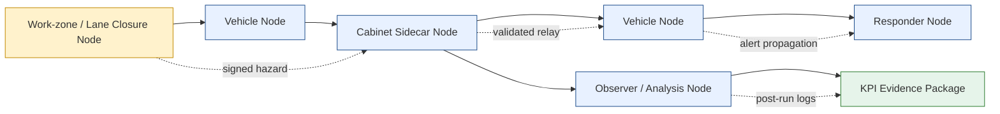

# PingNet

## Local-first communications for work-zone feasibility evaluation

PingNet is developing local-first, authenticated communications for participating work-zone and fleet nodes. The working prototype exchanges messages among equipped PingNet nodes without requiring continuous cellular coverage or a continuous cloud connection for local validation and relay.

The current prototype has completed controlled tabletop tests. The next step is to define a narrowly scoped work-zone feasibility evaluation with an operator, supported by independent technical review.

PingNet is not presented here as a production-ready safety system, a broad V2X replacement, or a universal vehicle and mobile platform. The work starts with a specific need: helping work-zone teams and participating drivers assess whether authenticated local communications can improve the flow of timely hazard information under defined conditions.

> Status reviewed September 28, 2026. The controlled tests described below were performed on April 26 and June 7, 2026.

---

## Current Status

### Demonstrated

- controlled six-node and ten-node tabletop operation
- tagged scenarios, structured run IDs, and mixed node roles
- signed message validation under the configured trust model
- replay and duplicate suppression mechanisms
- local message relay among participating PingNet nodes
- post-run log collection and KPI summaries
- CWZ/WZDx-aligned WorkZoneFeed-style and DeviceFeed-style GeoJSON export artifacts derived from selected test evidence

### Current preparation

PingNet is preparing for a possible customer-funded work-zone feasibility evaluation. Current work is focused on:

- defining one operator problem and the intended recipients of an alert
- understanding the operator's existing mapping and information workflow
- defining a bounded scope for independent technical review
- preparing a feasible evaluation plan, measurement approach, and evidence package
- discussing evaluation fit with work-zone operators, public-works and fleet teams, transportation agencies, and appropriate contractors

No paid evaluation, customer contract, authorized field site, completed independent review, or public-road deployment is confirmed in this update. Outreach and preparation should not be read as signed engagements or completed field tests.

---

## Work-Zone Use Case

The current use case is authenticated hazard-message propagation among equipped, participating PingNet nodes in a work-zone or fleet evaluation.

A work-zone, vehicle, responder, or cabinet-sidecar node can generate a signed hazard message. Nearby PingNet nodes validate the signed content under the configured trust model, apply replay and duplicate controls, and relay eligible messages through the local participating network. Observer nodes collect evidence for post-run analysis.

The current technical question is:

> Under agreed operating conditions, can the prototype deliver authenticated messages among participating nodes with measurable receipt delivery, latency, and continuity?

A scoped feasibility evaluation would not claim to measure crash reduction. Human awareness, driver response, and safety outcomes require separate study designs and should not be inferred from node receipt latency.

---

## Conceptual Architecture

The diagram below is a conceptual role and message-flow illustration. It is not a measured hop path or a deployed road layout.


```mermaid
flowchart LR
    WZ[Work-zone / Lane Closure Node] --> V1[Vehicle Node]
    V1 --> C1[Cabinet Sidecar Node]
    C1 --> V2[Vehicle Node]
    V2 --> EMS[Responder Node]
    C1 --> OBS[Observer / Analysis Node]
    OBS --> REPORT[KPI Evidence Package]

    WZ -. signed hazard .-> C1
    C1 -. validated relay .-> V2
    V2 -. alert propagation .-> EMS
    OBS -. post-run logs .-> REPORT

    classDef node fill:#e8f1ff,stroke:#1f4e8c,stroke-width:1px;
    classDef hazard fill:#fff2cc,stroke:#c28a00,stroke-width:1px;
    classDef report fill:#e6f4ea,stroke:#2e7d32,stroke-width:1px;

    class V1,V2,C1,OBS,EMS node;
    class WZ hazard;
    class REPORT report;
```

Simple view:

```text
[Hazard source]
        |
        v
[Vehicle node] <-> [Cabinet sidecar] <-> [Vehicle node] <-> [Responder node]
                                      |
                                      v
                          [Observer / analysis node]
                                      |
                                      v
                           [KPI evidence package]
```

Hop evidence remains log-derived from signed-envelope observations and relay logs. These results support fleet propagation and reliability claims but should not be presented as independent physical hop-depth reliability without topology correlation.

---

## Node Roles

### Cabinet Sidecar Node

A cabinet sidecar node is an edge device intended for reversible installation inside or near an existing traffic-signal controller cabinet. It supports local message relay and evidence collection. It does not modify controller software, timing plans, or safety-critical cabinet functions.

### Vehicle Node

A vehicle node is a portable unit for a participating fleet vehicle. It can receive eligible alerts, relay validated messages when configured to do so, and record events for post-run analysis.

Potential participants in an initial evaluation could include public-works, traffic-operations, utility, inspection, or other approved fleet vehicles. CAN bus integration is not assumed for an initial evaluation.

### Work-Zone Node

A work-zone node represents an active or simulated hazard source within the agreed evaluation scenario. It generates signed hazard messages for participating PingNet nodes.

### Responder Node

A responder node represents an approved public-safety, service, or support vehicle within the evaluation. It can receive eligible alerts, relay validated messages when configured to do so, and record receipt and latency evidence.

### Observer and Analysis Node

Observer nodes record scenario events and support post-run analysis. Their logs can contribute to receipt, latency, continuity, validation, replay, duplicate-handling, and scenario-level evidence.

---

## Local Path and Post-Run Evidence

```text
Hazard Source
    -> Node Runtime
    -> Signature and Message Validation
    -> Policy and Relay Decision
    -> Local Transport
    -> Nearby Participating Nodes
    -> Observer Logs
    -> Post-Run KPI and Export Artifacts
```

The working prototype uses a local-first communications path for message validation and relay among participating nodes. Safety-message acceptance does not require a cloud connection. Backhaul may be used later to collect logs, analyze evidence, and move post-run reports or export artifacts.

Signature checking authenticates signed content under the configured trust model. It does not independently prove that a reported hazard is factually correct, and it is not a security certification.

---

## Controlled Tabletop Evidence

The results below describe specific controlled tabletop evidence sets. They are not public-road results, service-level guarantees, independently certified reliability, or proof of crash prevention.

### Six-Node Baseline

Three tagged six-node dry runs were completed on April 26, 2026:

- `run-20260426-002`
- `run-20260426-003`
- `run-20260426-004`

| Item | Reported result |
|---|---:|
| Expected nodes observed | 6/6 |
| Range of reported per-run p95 latency values | 36-299 ms |
| Setting | Controlled tabletop |

This evidence set is also the source of the six-node demonstration video. It is separate from the ten-node measurements below.

### Ten-Node Baseline

Three tagged ten-node dry runs were completed on June 7, 2026:

- `run-10node-20260607-190405`
- `run-10node-20260607-192316`
- `run-10node-20260607-193016`

All three passed PingNet's internal reporting criteria.

| Item | Observed result |
|---|---:|
| Expected nodes observed | 10/10 in each run |
| Expected downstream receipts delivered | 54/54 across all three runs |
| Missing expected downstream receipts | 0 |
| Reported signature-validation success | 100% |
| Per-run p95 latency | 43 ms, 33 ms, and 30 ms |
| Range of per-run p95 latency values | 30-43 ms |
| Setting | Controlled tabletop |

The 30-43 ms figure is the range of the three per-run p95 values. It is not a pooled p95 and is not the range of all individual message delays. The 54/54 figure is observed delivery within this evidence set, not a universal reliability estimate.

### What These Controlled Runs Demonstrate

Implemented mechanisms include:

- signed message generation and validation under the configured trust model
- replay and duplicate suppression
- bounded local relay behavior
- mixed-role node orchestration
- tagged scenarios, log collection, and KPI reporting
- post-run export generation from selected evidence

Observed results in the cited evidence sets include:

- participation of the expected nodes
- delivery of the expected ten-node downstream receipts
- the reported per-run latency values listed above
- production of structured logs, KPI summaries, and export artifacts

These runs do not establish:

- public-road or long-duration reliability
- a measured improvement in driver or worker awareness
- crash reduction or another safety outcome
- comprehensive resistance to attack
- independent certification or formal standards conformance
- verified physical hop-depth reliability without topology correlation
- operational integration or automatic failover with existing vehicle, roadside, or agency systems

The combined ten-node report recorded zero invalid signatures dropped in these three runs. That observation is not presented as a headline security result because the evidence set does not establish a meaningful invalid-signature challenge population.

---

## CWZ/WZDx-Aligned Export and Integration Direction

PingNet includes a CWZ/WZDx-aligned export layer that maps validated pilot logs into WorkZoneFeed-style and DeviceFeed-style GeoJSON artifacts. These post-run artifacts support review and integration discussions. They are separate from the local real-time communications path.

### Available capability

- post-run WorkZoneFeed-style and DeviceFeed-style GeoJSON artifacts derived from selected test evidence
- structured run, scenario, node-role, and KPI context in the associated PingNet evidence workflow

### Under consideration with an evaluation partner

- interfaces that fit the partner's existing mapping and operational workflows
- the intended users, data handoffs, and review steps for the selected use case
- whether and how selected evidence should be translated into partner-facing artifacts

### Not claimed

- formal CWZ or WZDx conformance or certification
- a public registry listing or live agency feed service
- native OEM, C-V2X, DSRC, or SCMS interoperability
- tested automatic failover with existing vehicle or roadside systems
- universal compatibility with phones, drones, or micromobility devices

Export geometry may be modeled unless a field location has been explicitly verified. PingNet-specific KPI evidence is kept distinct from native feed fields. The existence of an export artifact does not establish deployment-time data exchange with an agency.

---

## Evaluation Measures

A proposed evaluation would define measures and thresholds with the participating operator before execution. Candidate technical measures include:

- expected-message receipt delivery under defined conditions
- receipt latency and per-run latency summaries
- continuity and node availability over an agreed test period
- signature-validation outcomes under the configured trust model
- replay and duplicate-handling behavior
- completeness of logs and after-action evidence
- fit with the operator's existing workflow and interface needs

Node-level communications metrics are not proxies for time to human awareness, driver response, crash reduction, or other safety outcomes. Those outcomes require appropriately designed human or operational studies.

```text
Agreed Scenario
    -> Participating Node Logs
    -> Collection Manifest
    -> KPI Aggregation
    -> Reviewed Export Artifacts
    -> Evidence-Based After-Action Report
```

---

## Current Development Focus

Near-term work supports evaluation readiness rather than broad feature expansion:

1. define the operator problem, intended recipients, and existing workflow
2. seek bounded independent technical review of the proposed evaluation
3. define scenario conditions, measures, success criteria, and stop criteria
4. prepare site, safety, data, and authorization requirements
5. improve deployment hygiene and evidence-package review
6. scope partner-specific integration questions without claiming connectors that do not exist

Python remains the current pilot runtime. Rust is a possible future implementation choice if measured requirements justify it. A Rust rewrite is not underway and is not a prerequisite for a feasibility evaluation.

---

## Evaluation Partner Fit

PingNet welcomes discussions with work-zone operators, public-works and fleet teams, state or local transportation agencies, and appropriate roadway contractors that want to assess one concrete problem.

Before an evaluation could proceed, the parties would need to agree on:

- the scenario and operating conditions
- the intended recipients and the information they need
- the existing workflow, mapping tools, and interface requirements
- scope, funding, site authorization, and safety responsibilities
- measurement methods, success criteria, and stop criteria
- data handling and an evidence-based after-action report

A useful initial partner does not need to commit to a corridor deployment. The first discussion should establish whether a bounded feasibility evaluation is appropriate and what evidence would support a decision.

### Discuss a scoped work-zone evaluation

- [Email Jonathan Garrett Jr.](mailto:jonathan.garrettjr@pingnet.net?subject=PingNet%20work-zone%20evaluation)
- [Schedule a 30-minute conversation](https://calendly.com/jonathan-garrettjr-pingnet)

---

## Roadmap

### Demonstrated

- controlled six-node and ten-node tabletop operation
- mixed-role participating-node configuration
- signed message validation under the configured trust model
- replay and duplicate suppression mechanisms
- local message propagation
- run and scenario tagging
- log collection and KPI summaries
- three consecutive six-node and three consecutive ten-node dry runs
- combined ten-node evidence output
- CWZ/WZDx-aligned post-run GeoJSON export artifacts

### Current preparation

- define one operator problem and its intended recipients
- document existing workflow and interface needs
- prepare a bounded independent technical-review scope
- draft an evaluation plan, evidence plan, and authorization checklist
- conduct operator and partner-fit discussions

### Proposed evaluation, subject to agreement

- agree on scope and funding
- obtain site authorization and assign safety responsibilities
- define scenario conditions, measurement methods, success criteria, and stop criteria
- evaluate receipt delivery, latency, continuity, and integration needs under those conditions
- produce a reviewed after-action report

### Conditional later work

- longer-duration and varied-layout testing
- independently correlated topology and hop evidence
- verified field geometry
- additional runtime hardening based on measured needs
- possible expansion toward an authorized 20-30-node corridor evaluation

The corridor concept is an aspiration. It is not presented as scheduled, funded, or authorized, and it depends on evidence, partner readiness, resources, and approval.

---

## Technical Direction

The current prototype runtime is Python-based. Current engineering priorities are reliable test execution, local-first communications, explicit validation boundaries, bounded relay behavior, transport abstraction, deployment hygiene, observability, and reviewable evidence.

Future implementation choices will be driven by measured evaluation needs. They are not prerequisites for defining the first scoped evaluation.

---

## Research Context

The [PingNet stakeholder research brief](https://pingnet.net/assets/documents/PingNet-Research-Brief.pdf) documents an earlier qualitative discovery phase. It is historical research, not current product validation or the current evaluation roadmap. Its earlier cellular and application-led pilot concept should not be read as the present local-first work-zone plan.

Charts, comparative efficacy statements, quotations, and organizational references in that brief require source, method, denominator, and permission review before they are reused as current claims. Additional alerts do not replace required traffic-control measures.

---

## What This Repository Is

This repository is a public technical overview of PingNet's work-zone prototype, controlled evidence, system boundaries, and proposed evaluation path. It is intended for operators, engineers, reviewers, funding stakeholders, and prospective evaluation partners who need a clear account of what exists, what was observed, and what remains to be tested.

## What This Repository Is Not

This repository is not the production codebase and does not disclose private implementation details, keys, credentials, proprietary evaluation materials, unpublished algorithms, or legal strategy.

It should not be read as a claim that PingNet is production-ready, independently certified, CWZ or WZDx certified, SCMS-ready, interoperable with C-V2X or DSRC, or a replacement for required work-zone traffic-control practices.

---

## Longer-Term Direction

The broader architecture may later be evaluated for responder awareness, fleet safety, infrastructure participation, standardized vehicle communications, cellular bridging, or other connected-safety uses. These are possible future directions, not current product commitments.

The present sequence is:

> controlled tabletop evidence -> scoped operator problem -> agreed feasibility evaluation -> evidence-based decision on later work

---

## Contact

Jonathan Garrett Jr.  
Founder, PingNet LLC

- Email: [jonathan.garrettjr@pingnet.net](mailto:jonathan.garrettjr@pingnet.net)
- Phone: [+1 (202) 656-5639](tel:+12026565639)
- Website: [pingnet.net](https://pingnet.net/)
- Schedule: [30-minute conversation](https://calendly.com/jonathan-garrettjr-pingnet)
- LinkedIn: [linkedin.com/in/jonathan-garrett-jr](https://www.linkedin.com/in/jonathan-garrett-jr/)

---

## Status Summary

As of September 28, 2026, PingNet has a working local-first prototype and controlled six-node and ten-node tabletop evidence. It is preparing for a narrowly scoped, customer-funded work-zone feasibility evaluation and seeking bounded independent technical review.

No paid evaluation, customer contract, authorized field site, completed independent review, or public-road deployment is announced here. Later field and corridor work remains conditional on an agreed problem, evidence plan, funding, partner readiness, resources, site authorization, and safety responsibilities.
